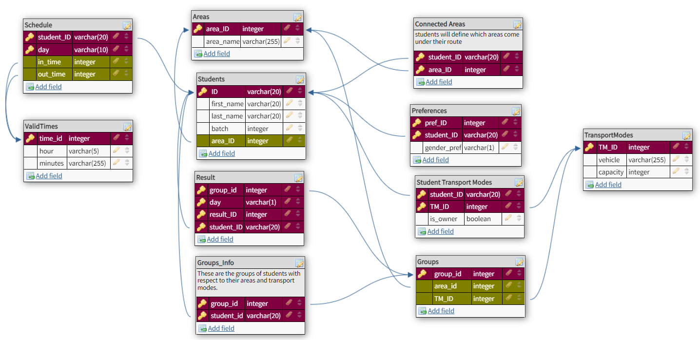

# Pool-Up-DBMS-Project    
 
This is the final project for the course Database Management Systems (DBMS) in Fall 2022. The course introduces databases, ERDs, database models, relational databases, and database management systems using SQL, Microsoft SQL Server, and windows forms made through C# in Visual Studio.

Our project pool up is a simple app-like platform designed for the Habib Community to connect students (and potentially faculty members as well) who want to share rides. 
Our project turns this into a management system that records different students wanting to carpool, and assigns them to their fellow students in the Habib Community.

### ERD Diagram:

The above is our final ERD Diagram which was used to design the tables for our database model.

The presentation can be found [here](Presentation.pdf).

The working model gifs and images will also soon be uploaded. 

### Thank you!
